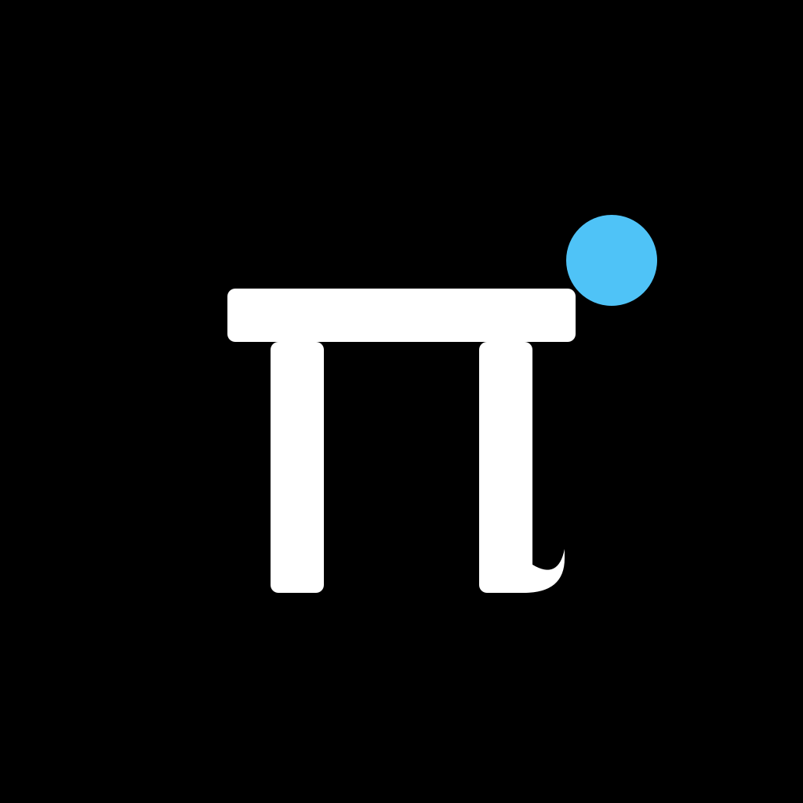

<p align="center">
  
</p>

<h1 align="center">Outpost-Pi</h1>

<p align="center">
  Control your <a href="https://github.com/earendil-works/pi">Pi coding agent</a> from your phone.
  Pair with a one-time QR code and chat with your local agent — even when you're away from your computer.
</p>

---

## Links

- **Official site** — <https://outpost-pi.kevoun.com>
- **Package documentation** — <https://pi.dev/packages/outpost-pi?name=outpost-pi>
- **GitHub** — <https://github.com/KevounC/outpost_pi>

### Downloads

| Platform | Status |
|---|---|
| Google Play (Android) | _Coming soon — 0.1.0 is sideload-only (new applicationId)_ |
| App Store (iOS) | _Unavailable until operator-owned Apple signing and listing are provisioned_ |
| APK (sideload, Android) | [GitHub Releases](https://github.com/KevounC/outpost_pi/releases) |

## What's in this repo

| Package | Stack | Role |
|---|---|---|
| [`app/`](./app) | Flutter (iOS / Android) | Mobile client |
| [`pi-extension/`](./pi-extension) | Node + TypeScript | Pi extension exposing `/outpost-pi` |
| [`relay/`](./relay) | Rust + Tokio | Stateless WebSocket relay |
| [`site/`](./site) | NextJS | Landing page + legal pages |

## Architecture

```
Flutter app ──wss──► Relay (Rust) ◄──wss── Pi extension (Node)
                                                  │
                                           Local Pi process
                                                  │
                                           UDS broker (local mesh)
                                                  │
                                           Other agents on the same machine
```

- **Pairing** via short-lived QR code; peers persisted in Keychain (mobile) and `~/.pi/remote/` (desktop)
- **TLS in transit** on the WebSocket connection
- **Ed25519 pairing authentication** — only paired devices can route messages through your peer slot on the relay (challenge-response handshake)
- **Owner-channel payloads are end-to-end encrypted after pairing**: the app and Pi authenticate the pairing and exchange sealed payloads that the relay forwards as opaque ciphertext. The relay still sees routing metadata, and cross-PC Pi↔Pi envelopes remain relay-readable plaintext — see [`relay/README.md`](./relay/README.md) for the security trade-offs

## Local agent mesh

When multiple Pi agents run on the same machine, they discover each other through
a **Unix Domain Socket broker** managed by the extension. One agent wins the
leader election and binds the socket; the others connect as clients. After that,
any agent can send a message or make a request to any other agent by name —
no relay, no network, no extra config.

Two LLM-facing tools are exposed in the Pi chat:

- `agent_send` — fire-and-forget message to another local agent
- `agent_request` — request/response with timeout

This lets you set up local multi-agent workflows (e.g. a `backend` agent asks a
`frontend` agent for help) entirely on your machine, in parallel with the remote
mobile pairing.

## Relay

Outpost-Pi is local-relay-only — you run your own relay from the
`relay/` source. There is no public/community relay. The relay forwards paired
app↔Pi owner payloads as opaque ciphertext, but it still sees routing metadata
and can read cross-PC Pi↔Pi envelopes. Running your own is both the privacy
stance and the default: the only thing your traffic ever touches is your own
infrastructure.

Full security trade-offs and the self-hosting guide live in
**[`relay/README.md`](./relay/README.md)**.

## Getting started

Build the extension from this checkout:

```bash
cd pi-extension
corepack pnpm install
corepack pnpm build
```

Register the checkout as a local extension in `~/.pi/agent/settings.json`
(preserve any existing settings and extension entries):

```json
{
  "extensions": ["/absolute/path/to/outpost_pi/pi-extension"]
}
```

Quit and relaunch Pi so it loads `pi-extension/dist/index.js`; `/reload` does
not reliably re-import a rebuilt local module. After any extension source
change, rebuild and fully restart Pi again.

Then configure the self-hosted relay and pair the mobile app:

```text
/outpost-pi set-relay <url>
/outpost-pi pair
```

The pair command renders a QR code for the Outpost-Pi mobile app to scan.

## Status

The current product scope, architecture, and settled direction live in
[`docs/VISION.md`](./docs/VISION.md), [`docs/SPEC.md`](./docs/SPEC.md),
[`docs/ARCHITECTURE.md`](./docs/ARCHITECTURE.md), and
[`docs/DECISIONS.md`](./docs/DECISIONS.md).

## Acknowledgements

Outpost-Pi is independently maintained and was built on
[remote_pi](https://github.com/jacobaraujo7/remote_pi) by Jacob Moura, released
under the MIT License.

## License

Outpost-Pi is licensed repository-wide under the MIT License — see
[`LICENSE`](./LICENSE).
